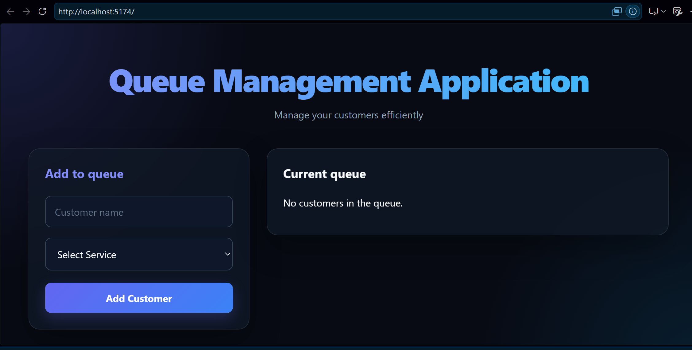

# Queue Management Application

A modern Queue Management Application built with **React** and **Vite** that allows users to manage customer queues efficiently.

## Features

- Add customers to the queue
- Select a service for each customer
- Update customer status:
  - Waiting
  - Serving
  - Completed
- Remove customers from the queue
- Responsive and modern UI
- Real-time state updates using React

## Tech Stack

- React
- JavaScript (ES6+)
- Vite
- CSS3

## React Concepts Used

- useState
- Props
- Callback Functions
- Controlled Components
- Event Handling
- Conditional Rendering
- List Rendering (`map`)
- State Management
- Spread Operator
- Functional State Updates

## Project Structure

```text
src/
│
├── components/
│   ├── QueueForm.jsx
│   └── QueueDisplay.jsx
│
├── App.jsx
├── App.css
└── main.jsx
```

## Installation

Clone the repository:

```bash
git clone https://github.com/Kartikkdg05/queue-management-app.git
```

Go to the project folder:

```bash
cd queue-management-app
```

If your Vite project is inside a subfolder:

```bash
cd Queue_Management
```

Install dependencies:

```bash
npm install
```

Run the development server:

```bash
npm run dev
```

Open the application in your browser:

```text
http://localhost:5173
```

## Screenshots



## Author

**Kartik Deep Gautam**

- GitHub: https://github.com/Kartikkdg05
- LinkedIn: https://linkedin.com/in/kartik-deep-gautam-kdg

---

⭐ If you found this project useful, consider giving it a star.